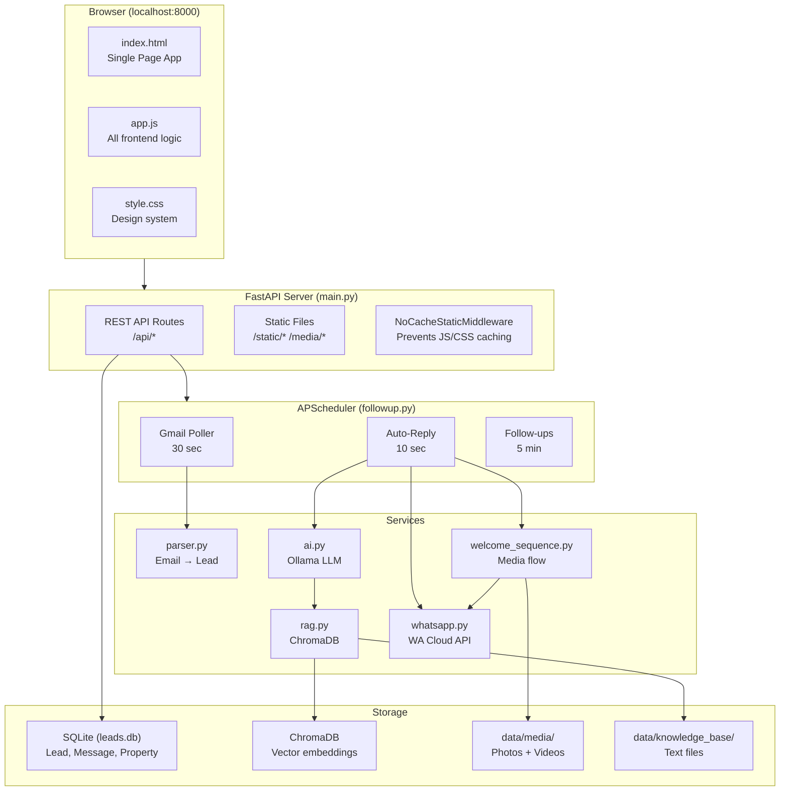

# LeadPilot — Implementation Plan & Developer Context

> **Purpose**: This document captures ALL architectural context, design decisions, bug history, and unfinished work from the development of LeadPilot. It is the **single source of truth** for any AI model or developer continuing work on this project. No conversation history is required.

---

## Table of Contents
- [System Architecture](#system-architecture)
- [Data Flow Diagrams](#data-flow-diagrams)
- [File-by-File Deep Dive](#file-by-file-deep-dive)
- [Frontend Architecture](#frontend-architecture)
- [Backend Architecture](#backend-architecture)
- [AI & RAG Pipeline](#ai--rag-pipeline)
- [Media System](#media-system)
- [Bug History & Lessons Learned](#bug-history--lessons-learned)
- [Unfinished Work & Next Steps](#unfinished-work--next-steps)
- [Common Pitfalls](#common-pitfalls)
- [How to Add Features](#how-to-add-features)

---

## System Architecture



---

## Data Flow Diagrams

### Lead Lifecycle

```
                    ┌──────────────────────────────┐
                    │     Lead Created              │
                    │  (Gmail / Manual / WhatsApp)   │
                    └──────────────┬───────────────┘
                                   │
                    ┌──────────────▼───────────────┐
                    │   status = "new"              │
                    │   welcome_sent = false         │
                    │   media_sent = false           │
                    │   auto_reply_enabled = true    │
                    └──────────────┬───────────────┘
                                   │
            ┌──────────────────────▼─────────────────────┐
            │   First incoming WhatsApp message           │
            │   (via webhook OR simulate button)          │
            └──────────────────────┬─────────────────────┘
                                   │
            ┌──────────────────────▼─────────────────────┐
            │   Welcome Sequence (threaded)               │
            │   welcome_sent = true                       │
            │   Sends: greeting → photos → videos → final │
            └──────────────────────┬─────────────────────┘
                                   │
            ┌──────────────────────▼─────────────────────┐
            │   Subsequent messages → Auto-Reply          │
            │   status = "contacted"                      │
            │                                             │
            │   Intent detection:                         │
            │   ├── Location keywords → Direction sequence│
            │   ├── Media keywords → ALL photos + videos  │
            │   └── General → RAG-powered AI reply        │
            └─────────────────────────────────────────────┘
```

### Message Processing Pipeline

```
                    Incoming Message
                           │
          ┌────────────────┼────────────────┐
          │                │                │
     WhatsApp           Simulate       Gmail Lead
     Webhook             Button          Poller
  (main.py:webhook)  (main.py:sim)  (followup.py)
          │                │                │
          └────────┬───────┘                │
                   │                        │
          Save Message(direction="in")      │
          lead.unread_count += 1            │
                   │                    Create Lead
                   │                   (no message)
                   │
     ┌─────────────▼──────────────┐
     │  process_unread_messages()  │
     │  (every 10 seconds)        │
     └─────────────┬──────────────┘
                   │
     ┌─────────────▼──────────────┐
     │  Checks (in order):        │
     │  1. auto_reply_enabled?    │──NO──► Skip
     │  2. source in [manual,wa]? │──NO──► Skip (email leads = no auto-reply)
     │  3. has phone?             │──NO──► Skip
     │  4. media_sent?            │──NO──► Send welcome sequence ► STOP
     │  5. location keywords?     │──YES──► _send_location_sequence() ► STOP
     │  6. Generate RAG reply     │────────► Send reply
     │  7. media keywords?        │──YES──► Also _send_media_on_request()
     └────────────────────────────┘
```

---

## File-by-File Deep Dive

### `backend/main.py` (45KB, ~1280 lines)
The monolithic API file. Contains:
- **App setup** (lines 117–193): Lifespan events, static file mounts, no-cache middleware
- **Lead CRUD** (lines ~200–500): Standard REST endpoints
- **Chat API** (lines ~800–1053): Message listing, sending, simulating, auto-reply toggle
- **Webhook** (lines ~1100–1200): WhatsApp verification + message receiving
- **AI endpoints**: Status check, reply generation
- **KB/RAG endpoints**: Index, search, status

**Critical route — simulate-incoming** (line 985):
```python
# 1. Find or create lead by phone
# 2. Save incoming Message(direction="in")
# 3. If not welcome_sent → spawn thread for welcome sequence
# 4. Return { "status": "ok", "lead_id": lead.id }
```

### `backend/followup.py` (20KB, ~525 lines)
The brain of automation. Three scheduler jobs + helper functions:

| Function | Lines | Purpose |
|----------|-------|---------|
| `start_scheduler()` | 24-57 | Registers all 3 APScheduler jobs |
| `process_unread_messages()` | 64-244 | **Main auto-reply loop** — intent detection, RAG reply, media/location triggers |
| `_send_location_sequence()` | 280-316 | Sends address text + Google Maps links + map images |
| `_send_media_on_request()` | 318-366 | Sends disclaimer + ALL photos + ALL videos |
| `process_followups()` | 369-430 | Sends scheduled follow-up messages |
| `fetch_and_save_gmail_leads()` | 432+ | Gmail polling wrapper |

**Intent Detection Keywords** (lines 150-168):
```python
# Location: 'location', 'address', 'kaha', 'where', 'how to reach', ...
# Media: 'photo', 'video', 'pic', '1bhk', '2bhk', 'furnished', 'sample flat', ...
```

### `backend/welcome_sequence.py` (9KB, ~248 lines)
Defines the exact welcome flow sent to new leads:

```python
WELCOME_MESSAGE = "Hello! 🙏 Welcome to Shapoorji Pallonji Vanaha..."
PHOTO_INTRO_MESSAGE = "Please find below the photos of Free to use..."
VIDEO_INTRO_MESSAGE = "Please find below the Videos of available flats..."
FINAL_MESSAGE = "We are here to help you with any queries..."
```

**Key functions:**
- `get_amenity_photos()` → returns sorted list of paths from `data/media/amenities/`
- `get_flat_videos()` → returns sorted list from `data/media/flats/` (mp4, 3gp, avi, mov, mkv, webm)
- `get_flat_photos()` → returns any images in `data/media/flats/`
- `send_welcome_sequence(phone)` → runs the full flow with sleeps
- `get_welcome_db_messages()` → returns list of dicts to store in DB after sending

**Media file helper** (lines 125-132):
```python
def _get_media_files(subfolder: str, extensions: tuple) -> list:
    """Get all media files from a subfolder, sorted by filename."""
    folder = os.path.join(MEDIA_DIR, subfolder)
    files = []
    for ext in extensions:
        files.extend(glob.glob(os.path.join(folder, f"*.{ext}")))
    return sorted(files)
```

### `backend/ai.py` (7KB)
Ollama LLM integration:
- `check_ollama()` / `list_models()` — health check
- `generate_rag_reply()` — main function: searches KB via ChromaDB, builds system prompt with context + conversation history, calls Ollama. Note: phi3:mini uses a simplified system prompt to maintain speed and coherence.
- `generate_auto_reply()` — simpler, without RAG context
- `generate_followup_message()` — generates follow-up message text

### `backend/rag.py` (10KB)
ChromaDB operations:
- `index_kb_folder()` — reads all `.txt`/`.md` files from `data/knowledge_base/`, chunks them (~500 chars with overlap), embeds with sentence-transformers, stores in ChromaDB
- `search_kb(query, n_results)` — semantic search against indexed chunks
- `search_properties(query)` — search property vectors
- Auto-indexed on server startup

### `backend/whatsapp.py` (6KB)
WhatsApp Business Cloud API wrapper:
- `send_whatsapp_message(phone, text, media_id, media_type)` — sends text or media
- `upload_whatsapp_media(file_bytes, mime_type, filename)` — uploads media, returns media_id
- `parse_webhook_message(data)` — extracts sender info from webhook payload
- **Mock mode**: When `WA_ACCESS_TOKEN` is not set, returns `{ "mock": true }` instead of calling the API

### `backend/parser.py` (31KB)
Gmail IMAP lead extraction:
- `fetch_gmail_leads()` — generator that yields parsed leads from inbox
- Portal-specific parsers for Housing.com, 99acres, MagicBricks
- HTTP redirect chain follower for obfuscated phone numbers
- Smart dedup: breaks after 20 consecutive duplicate leads

---

## Frontend Architecture

### `frontend/app.js` (~815 lines)

**Global State:**
```javascript
const API = '';           // Base URL (empty = same origin)
let currentLeadId = null; // Currently selected chat
let chatPollTimer = null; // setInterval ID for 45s poll
let _lastSeenMsgId = null; // Last message DB id (for smart refresh)
```

**Key Sections:**

| Lines | Section | Description |
|-------|---------|-------------|
| 1-5 | Globals | State variables |
| 6-77 | Utilities | `$()`, `toast()`, `api()`, `esc()`, `renderMsgContent()`, `timeAgo()` |
| 107-124 | Navigation | Tab switching, starts/stops chat polling |
| 129-162 | Dashboard | Stats + recent leads + source chart |
| 165-283 | Leads | Table, filters, welcome checkbox, tag selector |
| 357-504 | Chat Manager | `loadChats()`, `selectChat()`, gallery rendering |
| 511-560 | **Event Delegation** | Lightbox click handler for gallery + standalone media |
| 543-587 | Send Message | Text + file upload |
| 618-638 | Simulate | Send test message + auto-refresh chat |
| 641-661 | Polling | 45-second interval, `_lastSeenMsgId` comparison |
| 724-747 | Background | Dashboard/leads 15s poll, time-ago 5s updater |
| 749-812 | Lightbox | `openMediaViewer()` with keyboard nav |

**Critical: Event Delegation for Media Clicks** (lines 511-560):
```javascript
// Instead of inline onclick, we use event delegation on the parent container.
// This is REQUIRED because gallery HTML is set via innerHTML (dynamic content).
$('wa-messages').addEventListener('click', e => {
    // 1. Check for .wa-gallery-item (grouped media)
    //    → Read data-media-group attribute, decode, open lightbox
    // 2. Check for .wa-media-img (standalone image)
    //    → Extract filename from , open lightbox
    // 3. Check for .wa-media-vid (standalone video)
    //    → Extract filename from <video src>, open lightbox
});
```

**Critical: Gallery HTML Structure** (generated in `selectChat()`):
```html
<div class="wa-msg-bubble out wa-media-gallery-bubble">
  <div class="wa-media-gallery" data-media-group="ENCODED_JSON_ARRAY">
    <div class="wa-gallery-item" data-idx="0">
      
    </div>
    <div class="wa-gallery-item" data-idx="1">
      <video src="/media/flats/01_1bhk.mp4" preload="metadata"></video>
      <div class="wa-gallery-play">▶</div>
    </div>
    <!-- ... more items ... -->
  </div>
  <div class="wa-msg-time">02:34 PM</div>
</div>
```

The `data-media-group` attribute contains `encodeURIComponent(JSON.stringify(arrayOfTokens))` where tokens are like `["[IMAGE:01_amenity_space.jpeg]", "[VIDEO:01_1bhk.mp4]"]`.

### `frontend/style.css`
Complete dark-theme design system with CSS variables. Key class prefixes:
- `.wa-*` — WhatsApp-themed chat elements
- `.mv-*` — Media viewer (lightbox) elements
- `.nav-*` — Sidebar navigation
- `.badge-*` — Status badges

### `frontend/index.html`
Single HTML file with all views in `<section class="view">` containers. JavaScript controls visibility via `.active` class.

**Cache busting**: Script and CSS tags include `?v=VERSION` query params:
```html
<link rel="stylesheet" href="/static/style.css?v=20260506b">
<script src="/static/app.js?v=20260506b"></script>
```
**IMPORTANT**: Bump the `?v=` value after every JS/CSS change during development.

---

## AI & RAG Pipeline

### Models Available
```
gemma2:9b       — Primary model (recommended, best quality)
phi3:mini       — Lightweight alternative
kimi-k2.6:cloud — Cloud model (if configured)
```

### RAG Flow
```
User Query: "What amenities are available?"
    │
    ▼
1. search_kb(query, n_results=5)
   └── ChromaDB similarity search on indexed knowledge base chunks
    │
    ▼
2. Build system prompt:
   """
   You are a helpful real estate assistant for Shapoorji Pallonji Vanaha.
   
   Context from knowledge base:
   {chunk_1}
   {chunk_2}
   ...
   
   Lead info: {name}, {budget}, {location}
   
   Conversation history:
   Lead: {msg1}
   Agent: {msg2}
   ...
   """
    │
    ▼
3. Ollama API call: POST http://localhost:11434/api/generate
   └── model: phi3:mini, prompt: system + user message + prices + limited history
    │
    ▼
4. Response → truncated and cleaned → sent via WhatsApp
```

### Knowledge Base
- Files go in `data/knowledge_base/` (`.txt` or `.md`)
- Auto-indexed on server startup
- Can be re-indexed via API: `POST /api/kb/index`
- Chunking: ~500 characters with 50-char overlap
- Embedding model: `sentence-transformers` (auto-downloaded from HuggingFace)

---

## Media System

### How Media Is Stored in the Database
Media is NOT stored as binary blobs. Instead, `Message.content` holds **tokens**:
```
[IMAGE:01_amenity_space.jpeg]    → Photo token
[VIDEO:01_1bhk.mp4]              → Video token
```

These tokens are:
1. **Rendered by the frontend** as `` / `<video>` elements with appropriate `/media/` URLs
2. **Grouped by the frontend** — consecutive same-direction media tokens become a single gallery bubble
3. **Clickable** — event delegation opens the lightbox viewer

### How Media Is Served
FastAPI mounts `data/media/` as `/media/`:
```python
app.mount("/media", StaticFiles(directory=MEDIA_DIR), name="media")
```
So `data/media/amenities/01_amenity_space.jpeg` is served at `/media/amenities/01_amenity_space.jpeg`.

### How Frontend Determines Subfolder
In `app.js`, the filename is checked for amenity-related keywords:
```javascript
const isAmenity = fl.includes('amenity') || fl.includes('pool') || fl.includes('gym')
    || fl.includes('lounge') || fl.includes('ground') || fl.includes('kids')
    || fl.includes('indoor') || fl.includes('yoga') || fl.includes('reading')
    || fl.includes('work') || fl.includes('multipurpose');
const folder = isAmenity ? 'amenities' : 'flats';
```
**If you add new media files**, ensure their filenames match these keyword patterns, or update the check.

---

## Bug History & Lessons Learned

### Bug 1: Browser Caching (Root Cause of Many "Nothing Changed" Reports)
**Symptom**: Code changes to `app.js` or `style.css` had no effect in the browser.
**Root Cause**: FastAPI's `StaticFiles` mount served files without `Cache-Control` headers. The browser cached the old versions indefinitely.
**Fix**: 
1. Added `NoCacheStaticMiddleware` in `main.py` that sets `Cache-Control: no-cache, no-store` for `.js` and `.css` files
2. Added `?v=VERSION` cache-busting params to `<script>` and `<link>` tags in `index.html`
**Lesson**: Always bump the `?v=` parameter after changing JS/CSS. Or use the middleware.

### Bug 2: Lightbox Not Opening (JSON-in-HTML Quoting)
**Symptom**: Clicking images in the chat gallery did nothing — no lightbox appeared.
**Root Cause**: Gallery items used inline `onclick="openMediaViewer(${JSON.stringify(array)}, idx)"`. The JSON output contains double-quotes, which broke the HTML attribute (also double-quoted).
**Fix**: Removed all inline `onclick` from gallery items. Instead:
1. Store the JSON as `data-media-group` attribute (URL-encoded to avoid quoting issues)
2. Use event delegation on the `wa-messages` container
3. On click, find `.wa-gallery-item`, read parent's `data-media-group`, decode, call `openMediaViewer()`
**Lesson**: Never put complex JS expressions in inline HTML `onclick`. Use event delegation for dynamically generated content.

### Bug 3: Simulated Messages Not Appearing
**Symptom**: After clicking "Simulate" → "Send", the message appeared in the sidebar but not in the chat area.
**Root Cause**: Multiple issues:
1. `r.lead_id === currentLeadId` failed because one was string, one was number (strict equality)
2. `loadChats()` refreshed the sidebar but not the chat area
3. The bubble-count comparison (`querySelectorAll('.wa-msg-bubble').length !== msgs.length`) was wrong because galleries merge N messages into 1 bubble
**Fix**: After simulation, directly call `await selectChat(r.lead_id)` which re-fetches and re-renders the entire chat. Also schedule a delayed refresh at 8 seconds to catch the AI auto-reply.

### Bug 4: Chat Polling Too Frequent
**Symptom**: Chat window flickered/refreshed every 3 seconds.
**Root Cause**: Old code had `setInterval(..., 3000)`. When this was changed to `45000`, browser cached the old `app.js`.
**Fix**: The code was already correct at `45000ms`. The fix was the browser caching solution (Bug 1).

### Bug 5: Corrupt Function Injection
**Symptom**: A `get_flat_videos()` function was accidentally defined inside `_send_location_sequence()` in `followup.py` by a mis-targeted code edit.
**Root Cause**: AI tool edit specified the wrong line range and injected the function in the wrong location.
**Fix**: Removed the stray function definition.
**Lesson**: Always verify line ranges carefully when using code edit tools. Read the file after edits to confirm correctness.

---

## Unfinished Work & Next Steps

### Priority 1: Critical Fixes
- [ ] **Sidebar name duplication** — Some leads show "TestLeadTestLead" instead of "TestLead". Check `loadChats()` in `app.js` line 376-380.
- [ ] **`selectChat` not rendering on first open** — Sometimes requires clicking the lead twice. Likely a timing issue with `loadChats()` being called at the end of `selectChat()`.

### Priority 2: Production Readiness
- [ ] **WhatsApp webhook production** — Currently using Meta sandbox. Need to:
  1. Get Facebook Business verification
  2. Set up ngrok or a public URL for webhooks
  3. Register the webhook URL in Meta Developer console
- [ ] **Alembic migrations** — Currently deleting `leads.db` on schema change. Add Alembic for painless migrations.
- [ ] **Error handling** — Many API routes return raw 500 errors. Add proper error responses.

### Priority 3: Feature Enhancements
- [ ] **Catalogue integration** — User mentioned wanting a "View Catalog" button with rent/sell categories
- [ ] **Per-media delivery tracking** — Log unique WhatsApp message IDs for each photo/video sent, show ✓/✗ status per item
- [ ] **Read receipts** — Update message status (sent → delivered → read) via WhatsApp webhook status updates
- [ ] **Multi-language support** — Many leads speak Hinglish; current RAG works but could be improved with multilingual embeddings

### Priority 4: Technical Debt
- [ ] **Split `main.py`** — It's 45KB / 1280 lines. Split into separate route files using FastAPI `APIRouter`
- [ ] **WebSocket for chat** — Replace 45s polling with WebSocket for instant updates
- [ ] **Testing** — Add pytest tests for parser, AI, and API routes
- [ ] **Docker** — Containerize for easy deployment

---

## Common Pitfalls

### For AI Models Editing This Project

1. **Always bump cache version** after editing `app.js` or `style.css`:
   ```html
   <!-- index.html — change the ?v= value -->
   <script src="/static/app.js?v=NEW_VALUE"></script>
   ```

2. **Never use inline `onclick` with JSON** — Use event delegation instead (see Bug 2).

3. **Check both `followup.py` AND `main.py`** for message handling — both have welcome sequence triggers. The duplicate was intentional (webhook path vs. simulation path) but can cause confusion.

4. **Media filenames matter** — The frontend uses keyword matching on filenames to determine which `/media/` subfolder to load from. Don't rename files without updating the keyword list.

5. **Port 8000 conflicts** — If the server won't start, run:
   ```powershell
   netstat -ano | findstr :8000 | findstr LISTENING
   taskkill /F /PID <PID> /T
   ```

6. **`leads.db` location** — The database is at the project root AND at `backend/leads.db`. The canonical one used by FastAPI is in the project root (depends on working directory when starting). Check `db.py` for the actual path.

7. **Thread safety** — Welcome sequences and media sends run in daemon threads with their own DB sessions (`SessionLocal()`). Always use a fresh session, never share the request's session.

8. **Ollama model availability** — If `gemma2:9b` is not pulled, AI features silently fail. Run `ollama pull gemma2:9b` to download.

---

## Environment Setup Reference

### Prerequisites
- Python 3.10+
- Ollama installed and running (`ollama serve`)
- Gmail account with App Password enabled
- (Optional) WhatsApp Business API credentials

### Install
```bash
# Create virtual environment
python -m venv venv
venv\Scripts\activate

# Install dependencies
pip install -r requirements.txt

# Pull AI model
ollama pull gemma2:9b

# Configure
copy .env.example .env
# Edit .env with your credentials

# Run
start.bat
```

### Dependencies
```
fastapi          — Web framework
uvicorn          — ASGI server
sqlalchemy       — ORM
pydantic         — Data validation
requests         — HTTP client (for Ollama, WhatsApp API)
apscheduler      — Background job scheduling
chromadb         — Vector database for RAG
sentence-transformers — Text embeddings
python-dotenv    — .env file loading
```
